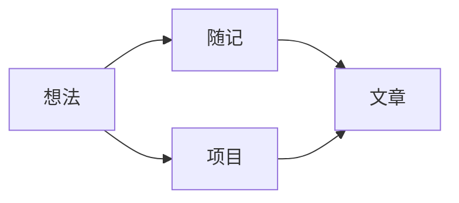

这个网站从一个很朴素的愿望开始：为长期写作留下一处稳定、安静，并且真正属于自己的空间。

它不追逐信息流，也不需要用数字证明热闹。文章、随记和项目会通过 Git 保存，每一次修改都能回看，每一份内容都能和实现一起迁移。

## 为什么是一个独立网站

平台适合分发，个人网站更适合沉淀。这里的 URL、排版与内容组织都不依赖某个平台不断变化的产品决定。

<Callout title="这是示例内容">
  这篇欢迎文章用于验证排版、目录与代码展示。开始正式写作后，可以直接替换或删除。
</Callout>

## 内容如何组织

这里暂时只有三种公开内容：

- **文章**：完成度更高、值得完整展开的思考；
- **随记**：不强迫自己长成文章的短片段；
- **项目**：记录问题、取舍和结果，而不只是放一张截图。



## 用 Git 写作

内容文件和图片放在一起，提交记录就是编辑记录。发布流程则交给 GitHub Actions：

```yaml title=".github/workflows/deploy.yml" showLineNumbers {2,4}
name: Deploy
on:
  push:
    branches: [main]
```

当内容还是草稿时，只需在 frontmatter 中保留 `draft: true`；本地可以预览，生产构建不会暴露它。

## 接下来

接下来要做的事很简单：持续替换示例内容，把真正值得留下的东西写进来。网站本身会保持克制，让阅读一直站在最前面。

这不是一次性完成的主页，而是一份会慢慢长大的个人档案。[^archive]

[^archive]: 页面结构可以演进，但稳定链接与 Git 历史会尽量被保留下来。
